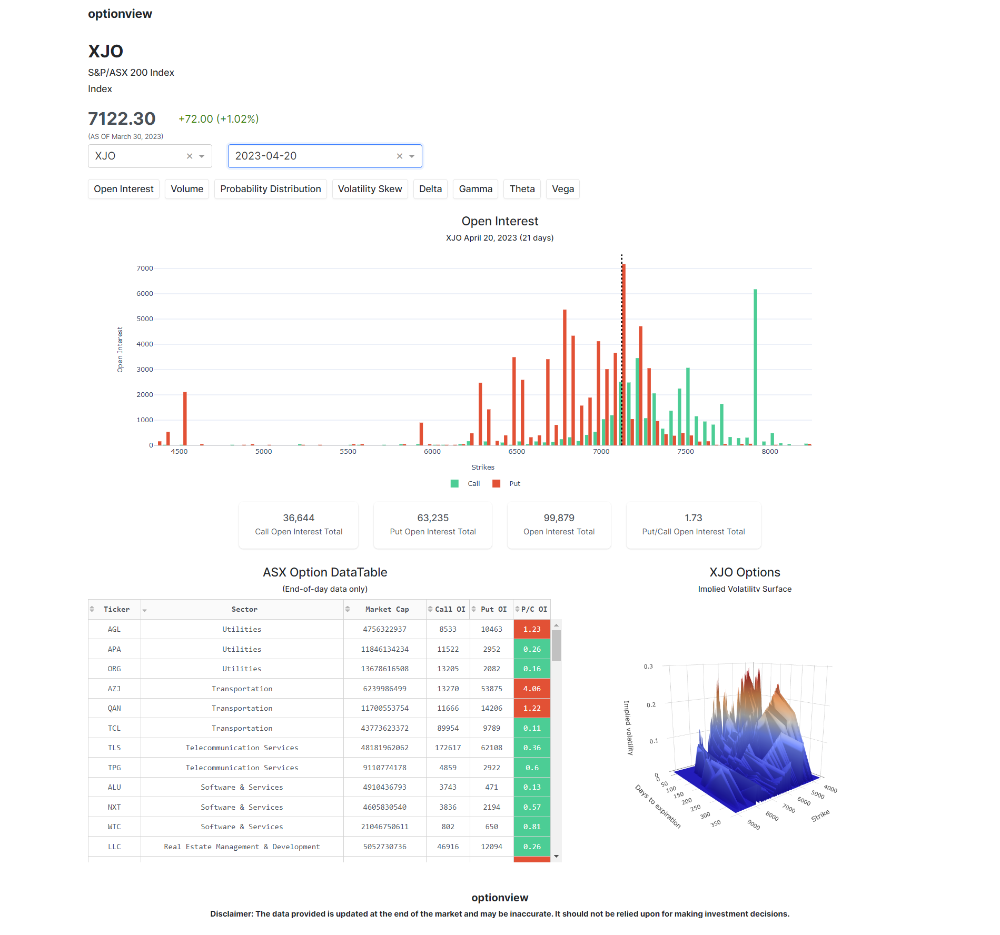
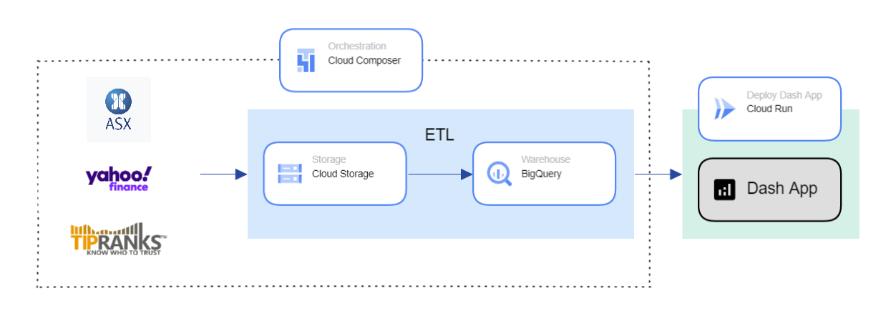
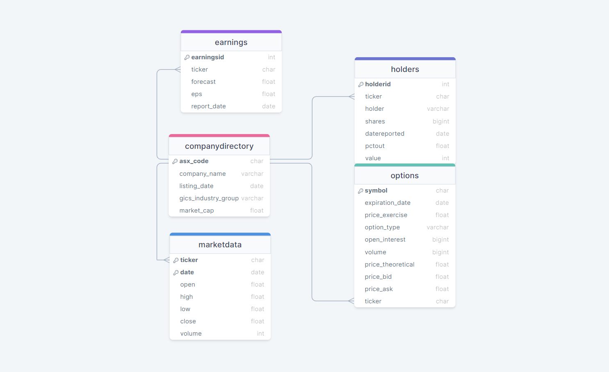

# Optionview
#### An analytics tool for ASX options data, designed for retail investors

### Problem 
The modern dashboards, apps, and screeners for options trading focus on US options, leaving retail investors in Australia struggling to find accessible and user-friendly analytics tools for ASX options data without connecting to a broker.

Examples  include:
* [Spot Gamma](https://spotgamma.com/)
* [Optioncharts](https://optioncharts.io/options/SPY/overview/option-statistics)
* [Bar chart's option screener](https://www.barchart.com/options/options-screener?orderBy=baseSymbol&orderDir=asc)

### Solution
Webscraped option chains and other financial data into BigQuery warehousing to build a dashapp with Plotly Dash. Orchestrated with Airflow/Cloud Composer and deployed the app on Cloud Run. The resulting product is a free and convenient analytics tool for ASX options data, specifically designed for retail investors. 

I've already received positive feedback from users in an ASX trading group on Discord and I'm continuing to work on additional features to enhance the app.

### Users 
Retail investors who want to have access to a convenient and free analytics tool for ASX options data without connecting to a broker. Currently used by the ASX Trading Chat discord server.

___

### [Click here to visit the dashboard!](https://optionview-w2bdqrbkka-ts.a.run.app/)

